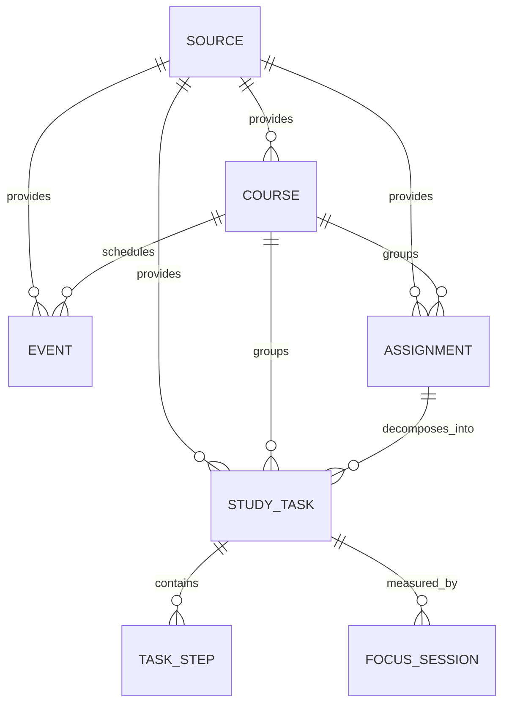

# Study OS data model

Study OS is a local-first application. The SQLite database is stored by Tauri in the operating system's application-data area and is never part of the repository. Schema changes are applied through numbered migrations in `src-tauri/migrations/`.

## Entity responsibilities

- **Source** records where imported or manually entered data originated. It stores no credentials. Future adapters may use non-secret integration metadata.
- **Course** is the academic context shared by events, assignments, and study tasks.
- **Event** is something fixed on the time axis: a class, exam, meeting, personal event, or reserved study block.
- **Assignment** is an external obligation, usually with a due date and submission lifecycle.
- **StudyTask** is a concrete action the learner can perform. It may optionally be derived from an assignment, but it also supports independent tasks.
- **TaskStep** is an ordered checklist item belonging to a study task.
- **FocusSession** is one measured period of work on a task. It owns timer state and accumulated elapsed seconds.

## Why Event, Assignment, and StudyTask stay separate

An **Event** answers “when does something happen?”, an **Assignment** answers “what obligation is due?”, and a **StudyTask** answers “what action will I do now?”. One assignment can therefore become several executable tasks, while a class remains an event even if it inspires later study tasks. This separation is required for the future decision engine.

## FocusSession lifecycle

`running` → `paused` → `running` may repeat without creating a new session. Each pause persists `elapsed_seconds` and increments `pause_count`; resume refreshes `last_resumed_at`. Completion stores the final elapsed value and `ended_at`, sets the session to `completed`, and marks its task `done`. Compact, Expanded, and Pet are presentation modes and do not create sessions.

At most one `running` or `paused` session can exist at once. The current-quest rule is intentionally small: running-session task, paused-session task, `doing` task, then the highest-priority open/default task.

## Restart and time policy

If the process stops while a session is `running`, the next PIP initialization changes it and its task to `paused` without modifying `elapsed_seconds`. Time spent while the app was closed is not counted. The user explicitly resumes from the saved value.

All timestamps are stored as UTC ISO 8601 strings. UI code converts them to the user's local timezone only when formatting for display. IDs are text UUIDs for user-created rows so records can later merge across external sources; deterministic `seed:*` IDs make development seed data idempotent.

## Source adapters

Future iCal, e-Campus, or other adapters write through repositories and identify imported records with `(source_id, external_id)`. Partial unique indexes prevent duplicate imported courses, events, and assignments while allowing either field to remain null for manual data. Secrets, session cookies, private calendar URLs, and credentials must never be stored in seed data or committed files.
